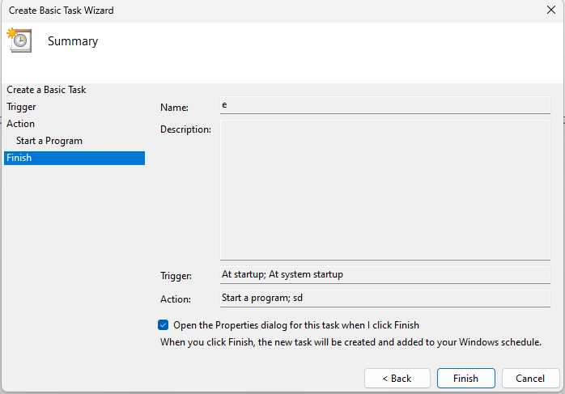

# Guide to fix issues with FPS for Dell Inspiron 7577
# (NVIDIA GeForce GTX 1060 with Max-Q Design)

#
## *Backstory*
*Using my laptop has always been a joy, but it had a constant problem with low FPS during my gaming sessions. As a kid, I didn't know what to do, so I tried all I could think of with NVIDIA drivers. Surprisingly, after reinstalling the drivers, the laptop started to work fine in games, but only until shutting down. Thus, every time I wanted to play games, I had to repeat the same monotonous steps.*

*After about a year, I found someone on the Internet who seemed to know the solution to this issue. He suggested disabling and then enabling the driver using "Device Manager", and that seemed to work fine. However, doing this many times was a hassle, so I decided to automate the process.*


# Following Steps
1) Install Windows Driver Kit (WDK) (https://learn.microsoft.com/en-us/windows-hardware/drivers/download-the-wdk)
> We will be using devcon.exe for performing actions with drivers, and it`s the only humane way to install it.
2) Open Powershell as Administrator

3) Run the following command: ```Set-ExecutionPolicy RemoteSigned```

4) GitClone the project or Download as ZIP file (Extract it) 
5) Open Task Scheduler as Administrator

6) Right click on "Task Schedular library" select "New Folder"

7) Expand the "Task Schedular library" and Navigate to your folder
8) Right click on empty space and choose "Create Basic Task"

9) Name however you want to click "Next"

10) Select "When I log on" click "Next"

11) Select "Start a Program" click "Next"

12) Click on "Browse" and Navigate to the script, this path you get needs to be copied in "Add arguments" in the following syntax "-File <your_path>", and in the action type "powershell"


> I include two scripts for this purpose, the only difference is how the find "PCI" of the Nvidia Driver (basically speaking - ID), however I recommend to use the first one, as the names of the drivers should be identical due to the same model of the laptop.
13) Check "Open the Properties dialog for this task..." and click "Finish"

14) Make the following configuration and click "Ok"


### Thats all, as simple as possible! You are now free of low fps gaming
